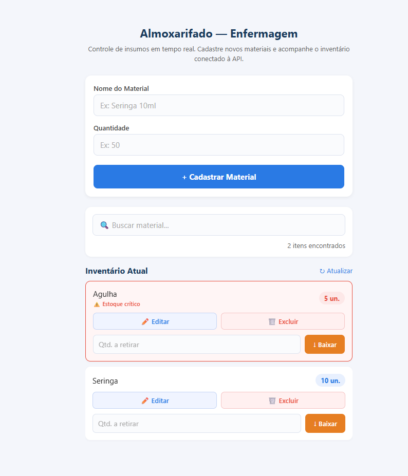
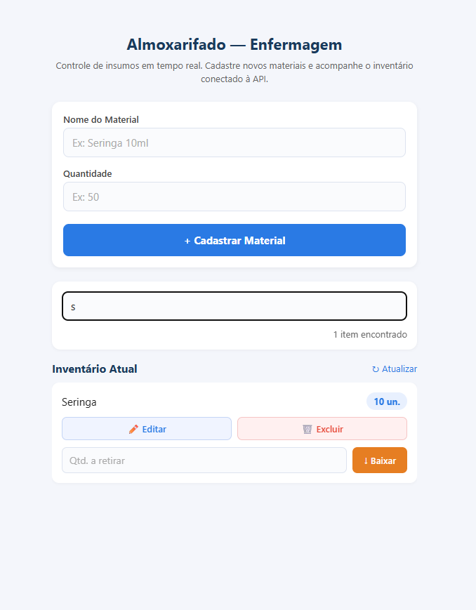
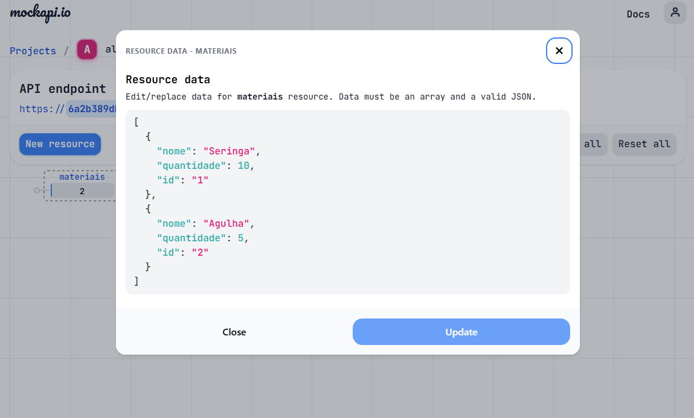

# 📦 SysAlmoxarifado — Controle de Estoque (Enfermagem)

Sistema mobile de controle de insumos médicos desenvolvido para modernizar o almoxarifado de um laboratório de enfermagem, substituindo o fluxo manual de papel + Excel por uma interface conectada em tempo real à API.

---

## 🎯 Contexto do Projeto

O levantamento de requisitos identificou os principais problemas do processo atual:

- Controle feito em Excel com rascunho prévio em papel
- Sem contabilização automática de entrada/saída de materiais
- Sem alertas visuais de validade ou estoque zerado
- Acesso limitado ao computador, sem mobilidade dentro do ambiente de estoque

---

## 🚀 Tecnologias Utilizadas

| Tecnologia | Versão | Função |
|---|---|---|
| React Native | 0.74.5 | Framework mobile |
| Expo | ~51.0.0 | Toolchain e build |
| MockAPI | — | Backend RESTful simulado |
| Jest + jest-expo | ^29 / ^51 | Testes automatizados |
| @testing-library/react-native | ^13 | Utilitários de teste |

---

## 📋 Funcionalidades por Sprint

### Sprint 1 — Fundação, API e Inventário Mobile
- ✅ **GET /materiais** — Carrega o inventário ao abrir o app via `useEffect`
- ✅ **POST /materiais** — Cadastra novo insumo com nome e quantidade
- ✅ Lista de rolagem com `FlatList` atualizada dinamicamente
- ✅ Validação de campos antes do envio com mensagens de erro inline
- ✅ Campo de quantidade aceita apenas números
- ✅ Feedback visual de carregamento com `ActivityIndicator`
- ✅ Botão de atualização manual do inventário

### Sprint 2 — Regras de Negócio e Saídas
- ✅ **Baixa rápida de estoque** — campo de retirada por item com `PUT` que subtrai do estoque atual
- ✅ **Exclusão de material** — `DELETE` remove permanentemente da MockAPI e atualiza a interface
- ✅ **Edição de material** — carrega dados no formulário principal para edição via `PUT`
- ✅ **Validação de regra de negócio** — função pura `validarRetirada` em `src/utils/validacoes.js` impede retiradas maiores que o estoque ou com valor zero/negativo

### Sprint 3 — Dashboard Mobile e Publicação
- ✅ **Filtro em tempo real** — campo de busca filtra materiais pelo nome à medida que o usuário digita, usando `useMemo` para performance
- ✅ **Totalizador** — exibe a contagem de itens encontrados, atualizada conforme o filtro aplicado
- ✅ **Indicador de estoque crítico** — itens com quantidade abaixo de 10 recebem fundo vermelho, borda de alerta e badge `⚠️ Estoque crítico`
- ✅ **Resiliência de rede** — todos os blocos de requisição possuem `try/catch` com mensagens amigáveis, prevenindo travamentos do app
- ✅ **FlatList sempre renderizada** — o indicador de carregamento é exibido separadamente, mantendo a lista acessível para os testes automatizados

---

## ⚙️ Como Rodar o Projeto

### Pré-requisitos

- Node.js 18+
- npm ou yarn
- Expo Go instalado no celular (Android ou iOS)

### 1. Configure a MockAPI

1. Acesse [mockapi.io](https://mockapi.io) e crie uma conta
2. Crie um novo projeto (ex: `sysalmoxarifado`)
3. Adicione o recurso **`materiais`** com os campos:
   - `nome` → String
   - `quantidade` → Number
4. Copie a URL gerada (ex: `https://abc123.mockapi.io/api/v1/materiais`)

### 2. Configure a URL no App

Abra o arquivo `App.js` e substitua a constante:

```js
const API_URL = 'https://SEU_ID.mockapi.io/api/v1/materiais';
```

### 3. Instale as dependências

```bash
npm install
```

### 4. Inicie o app

```bash
npx expo start
```

Escaneie o QR Code com o **Expo Go** ou pressione `a` para abrir no emulador Android.

### 5. Execute os testes automatizados

```bash
npm test
```

---

## 🗂️ Estrutura de Arquivos

```
/
├── App.js                       # Componente principal (Sprint 1, 2 e 3)
├── index.js                     # Entry point Expo
├── package.json
├── jest.config.js
├── README.md
├── screenshots/                 # Capturas de tela do app
│   ├── Tela Principal.png
│   ├── Tela com Materiais.png
│   ├── Alerta.png
│   ├── Filtro.png
│   ├── mockapi.png
│   └── Video.mp4
├── src/
│   └── utils/
│       └── validacoes.js        # Função pura validarRetirada (Sprint 2)
└── __tests__/
    ├── sprint1.test.js
    ├── sprint2.test.js
    └── sprint3.test.js
```

---

## 🧪 Contrato de Testes (testID)

### Sprint 1

| Componente | testID |
|---|---|
| TextInput — Nome do Material | `input-nome` |
| TextInput — Quantidade | `input-quantidade` |
| TouchableOpacity — Cadastrar | `btn-cadastrar` |
| FlatList — Inventário | `lista-materials` |

### Sprint 2

| Componente | testID / contrato |
|---|---|
| TextInput — Quantidade a retirar | `input-retirada` |
| TouchableOpacity — Confirmar baixa (PUT) | `btn-baixar` |
| TouchableOpacity — Excluir item (DELETE) | `btn-excluir` |
| Função pura de validação | `validarRetirada(estoqueAtual, quantidadeRetirada)` em `src/utils/validacoes.js` |

### Sprint 3

| Componente | testID / contrato |
|---|---|
| TextInput — Campo de busca | `input-busca` |
| Text — Totalizador de itens | `total-itens` |
| Card com estoque crítico (qtd < 10) | `accessibilityLabel="estoque-critico"` |

---

## 📸 Screenshots

### Tela principal


### Tela principal com materiais cadastrados


### Estoque crítico — Alerta visual


### Filtro de busca em tempo real


### MockAPI — Configuração do recurso


### Demonstração em vídeo
[▶️ Assistir demonstração](https://github.com/Universidade-Cesumar/prova-2b-dev-mobile-matheuscoronado/releases/tag/Video/Video.mp4)

---

## 👨‍💻 Autor

**Matheus Coronado**
Disciplina: Desenvolvimento Mobile
